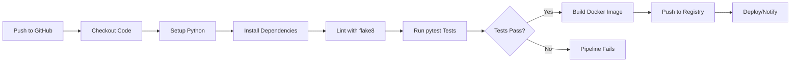

# CI/CD Pipeline Demo

> A practical demonstration of modern CI/CD practices using GitHub Actions and Docker

[](https://github.com/gomezf2/ci-pipeline-demo/actions/workflows/ci.yml)

## Overview

This repository demonstrates the implementation of a production-grade CI/CD pipeline from the ground up. The project focuses on real-world DevOps practices, with each commit documenting the development process—including troubleshooting and iterative improvements—to showcase practical problem-solving skills.

**Project Goals:**
- Demonstrate proficiency with modern CI/CD workflows
- Showcase practical DevOps skills applicable to production environments
- Build reliable, automated deployment pipelines
- Maintain a portfolio piece reflecting current industry standards

## Current Status

**Phase:** CI Foundation (Complete)  
**Next Step:** Docker Integration

## Features

### Implemented
- **Automated Linting:** Code quality checks with `flake8` on every push
- **Automated Testing:** Full test suite execution with `pytest`
- **Continuous Integration:** Automated validation of all pull requests
- **Multi-stage Workflow:** Production-ready pipeline structure

### Planned
- Docker containerization and build validation
- Docker Hub registry integration
- Semantic versioning and release tagging
- Build status notifications (Slack/Discord)
- Container security scanning

## Tech Stack

| Component | Technology |
|-----------|-----------|
| CI/CD | GitHub Actions |
| Containerization | Docker |
| Language | Python 3.9 |
| Testing | pytest, pytest-flask |
| Code Quality | flake8 |
| Framework | Flask |

## Pipeline Architecture



## Project Structure

```
ci-pipeline-demo/
├── .github/
│   └── workflows/
│       └── ci.yml          # GitHub Actions workflow configuration
├── app/
│   ├── __init__.py         # Package initialization
│   └── app.py              # Flask application
├── tests/
│   └── test_app.py         # Application test suite
├── requirements.txt        # Python dependencies
├── Dockerfile              # Container definition (coming soon)
└── README.md               # Project documentation
```

## Local Development

### Prerequisites
- Python 3.9 or higher
- pip package manager

### Setup Instructions

```bash
# Clone the repository
git clone https://github.com/gomezf2/ci-pipeline-demo.git
cd ci-pipeline-demo

# Install dependencies
pip install -r requirements.txt

# Run tests
pytest

# Run linter
flake8 .

# Start the application
python app/app.py
```

The application will be available at `http://localhost:5000`

## Learning Outcomes

This project demonstrates proficiency in several key areas:

**CI/CD Fundamentals**
- Pipeline design and implementation
- Automated testing and validation
- Build automation

**DevOps Practices**
- Infrastructure as Code (GitHub Actions YAML)
- Containerization with Docker
- Environment configuration management

**Software Engineering**
- Test-driven development
- Code quality enforcement
- Version control best practices

## Technical Decisions

### Import Path Configuration
**Challenge:** `pytest` encountered `ModuleNotFoundError` in CI environment  
**Solution:** Added `PYTHONPATH` environment variable to GitHub Actions workflow  
**Key Lesson:** CI environments require explicit Python path configuration

### Dependency Management
**Decision:** Single `requirements.txt` file  
**Rationale:** Simplified dependency management for demonstration project  
**Trade-off:** Development dependencies installed in all environments (production would use separate requirements files)

*Additional learnings and decisions will be documented as the project evolves*

## Contributing

While this is primarily a personal learning project, feedback and suggestions are welcome. Feel free to:
- Open an issue for discussion
- Suggest pipeline improvements
- Share related projects or resources

## License

MIT License - This project is open source and available for use as a template for CI/CD learning projects.

---

**Note:** This is an active learning project. The commit history intentionally reflects the real development process, including debugging and iterations, to demonstrate practical problem-solving skills in DevOps engineering.

