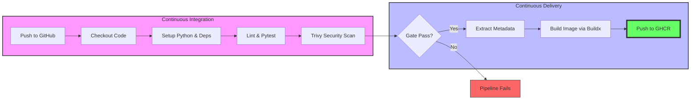

# CI/CD Pipeline Demo

> A production-grade CI/CD pipeline built with GitHub Actions and Docker, demonstrating deliberate architectural decisions across automated testing, container security, and artifact traceability.


---

## Overview

This repository implements a multi-stage CI/CD pipeline from the ground up. Each stage has a distinct responsibility — linting, testing, security scanning, building, and publishing are deliberately separated so that failures are immediately attributable and the pipeline remains easy to reason about as it grows.

The commit history reflects the real development process, including debugging and iterations, to demonstrate practical problem-solving rather than a clean-room tutorial reproduction.

**Current Status:** Core pipeline complete. Next planned extension: multi-stage Docker builds to separate build-time and runtime dependencies, reducing final image size and shrinking the Trivy scan surface.

---

## Pipeline Architecture


```mermaid
graph LR
    %% Section 1: Continuous Integration
    subgraph CI [Continuous Integration]
        A[Push to GitHub] --> B[Checkout Code]
        B --> C[Setup Python & Deps]
        C --> D[Lint & Pytest]
        D --> E[Trivy Security Scan]
    end

    %% Section 2: Logic Gate
    E --> F{Gate Pass?}

    %% Section 3: Continuous Delivery
    subgraph CD [Continuous Delivery]
        F -->|Yes| G[Extract Metadata]
        G --> H[Build Image via Buildx]
        H --> I[Push to GHCR]
    end

    %% Section 4: Failure Path
    F -->|No| J[Pipeline Fails]

    %% Styling
    style CI fill:#f9f,stroke:#333,stroke-width:2px
    style CD fill:#bbf,stroke:#333,stroke-width:2px
    style J fill:#f66,stroke:#333,stroke-style:dashed
    style I fill:#6f6,stroke:#333,stroke-width:4px
```

---

## Tech Stack

| Component | Technology | Purpose |
|---|---|---|
| CI/CD | GitHub Actions | Workflow orchestration |
| Containerisation | Docker / Buildx | Reproducible builds |
| Container Registry | GitHub Container Registry (GHCR) | Artifact storage and versioning |
| Vulnerability Scanning | Trivy (Aqua Security) | Shift-left container security |
| Language | Python 3.9 / Flask | Application under test |
| Testing | pytest, pytest-flask | Automated correctness validation |
| Code Quality | flake8 | Style and syntax enforcement |

---

## Technical Decisions

### Stage Separation
**Problem:** Collapsing lint, test, scan and build into a single stage makes failures ambiguous — a security issue looks the same as a syntax error in the logs.

**Decision:** Each concern runs as a distinct stage with an explicit pass/fail gate.

**Outcome:** Any failure is immediately attributable to a specific stage, reducing the time to diagnose a broken pipeline and making the system easier to extend without unintended side effects.

---

### Automated Tagging Strategy
**Problem:** Manually versioning Docker images is prone to error and makes it difficult to trace a running container back to the exact code that produced it.

**Solution:** Implemented `docker/metadata-action` to generate dynamic tags derived from Git SHAs and branch names automatically.

**Outcome:** Every image in the registry maps 1:1 to a specific commit. Rollbacks and incident root-cause analysis become deterministic — you always know exactly what code is running in any environment.

---

### Security Gate Placement
**Problem:** Discovering container vulnerabilities after an image is published means the fix requires a new build, re-test, and re-publish cycle — higher cost and higher risk than catching it earlier.

**Decision:** Trivy scans the filesystem before the publish stage. Critical findings block the pipeline entirely rather than producing a warning.

**Outcome:** No image reaches the registry unless it has passed a security audit, shifting that responsibility left into the development workflow rather than downstream into operations.

---

### Build Optimisation
**Decision:** Using `type=gha` cache backend with Docker Buildx.

**Rationale:** CI environments rebuild from scratch on every run by default. Layer caching means only the layers affected by a code change are rebuilt, reducing pipeline execution time and improving the feedback loop.

**Trade-off:** Cache hit rate depends on layer ordering in the Dockerfile. Dependencies are installed before application code is copied specifically to maximise cache reuse on code-only changes.

---

### Import Path Configuration
**Problem:** `pytest` raised `ModuleNotFoundError` in the CI environment despite tests passing locally.

**Root cause:** CI environments do not inherit local Python path configuration. The project root was not on `PYTHONPATH` in the runner.

**Solution:** Explicitly set the `PYTHONPATH` environment variable in the GitHub Actions workflow.

**Key lesson:** CI environments must be treated as clean, explicit systems. Implicit local configuration is never safe to rely on.

---

### Dependency Management
**Decision:** Single `requirements.txt` file.

**Rationale:** Simplified dependency management appropriate for a demonstration project.

**Trade-off acknowledged:** Development dependencies (pytest, flake8) are installed in all environments. In a production setup this would be split into `requirements.txt` and `requirements-dev.txt` to keep the production image lean. Kept unified here to reduce setup friction.

---

## Project Structure

```
ci-pipeline-demo/
├── .github/
│   └── workflows/
│       └── ci.yml          # Pipeline definition
├── app/
│   ├── __init__.py         # Package initialisation
│   └── app.py              # Flask application
├── tests/
│   └── test_app.py         # Test suite
├── Dockerfile              # Container definition
├── requirements.txt        # Python dependencies
└── README.md
```

---

## Running Locally

**Prerequisites:** Python 3.9+, Docker

```bash
# Clone the repository
git clone https://github.com/gomezf2/ci-pipeline-demo.git
cd ci-pipeline-demo

# Install dependencies
pip install -r requirements.txt

# Run tests
pytest

# Run linter
flake8 .

# Build and run the container directly
docker build -t ci-pipeline-demo .
docker run -p 5000:5000 ci-pipeline-demo
```

The application will be available at `http://localhost:5000`

---

## What I Would Add Next

**Multi-stage Docker builds** — separating the build stage (which needs dev tools) from the runtime stage (which only needs the application) would meaningfully reduce the final image size and shrink the attack surface that Trivy has to scan. This is the logical next extension given the security-first approach already in place.

---

## Feedback

This is an active project. If you spot an architectural decision that could be improved or have suggestions on the pipeline design, feel free to open an issue — reasoned critique is welcome.

---

*MIT License — open source and available as a reference for CI/CD pipeline implementations.*
